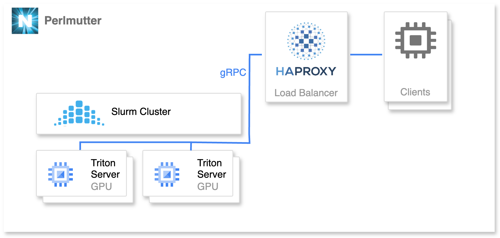

# Running NVIDIA Triton Inference Server on SLURM

## Introduction
This GitHub repository provides a guide for setting up and running NVIDIA Triton Inference Servers on Slurm-managed cluster (specifically the NERSC <u>Perlmutter</u> Supercomputer). Triton is an open-source inference serving software that simplifies the deployment of AI models at scale.

This repository provides an example of deploying PyTorch ResNet Triton server on Perlmutter (see diagram below for overview). The ResNet example is taken from [here](https://github.com/triton-inference-server/tutorials/blob/59c85a06472b9087ec23345279dd91a528b3dbcb/Quick_Deploy/PyTorch/README.md). Modify this example to easily get started with a Triton server deployment.

<figure>
  
  <figcaption>Figure 1: Overview of the example PyTorch ResNet Triton server deployment on Perlmutter. Works with both gRPC and HTTP traffic.</figcaption>
</figure>

## Getting Started
Download this repository and alter the Slurm job script ([`start_triton_slurm.sh`](start_triton_slurm.sh)) with your relevant Slurm and Triton configurations.

> [!NOTE]
> This repository uses Shifter to operate containers, but other container software will work as well. Likewise, there are many other load balancing software options that also work with gRPC and HTTP traffic.


### Step 1: Start up Triton
Start up your Triton server via `sbatch`:
```bash
sbatch -N 2 -A elvis start_triton_slurm.sh
```
or interactively in a slurm job:
```bash
salloc -N 1 -t 01:00:00 -C gpu -q interactive -A elvis
./start_triton_slurm.sh
```

This starts up a triton server from `nvcr.io/nvidia/tritonserver:24.11-py3` image and loads in the ResNet50 PyTorch model (see this folder for the model and triton configuration):
```
model_repository
|
+-- resnet50
    |
    +-- config.pbtxt
    +-- 1
        |
        +-- model.pt
```

You can verify the Triton servers are running correctly via a `curl` request:
```bash
$ curl <node-address>:8000/v2/health/ready
```

### Step 2: Start up Load Balancer
Once the triton server have started up, you can then deploy the load balancer with your node addresses. This bash script automatically adds your node addresses to the [`haproxy.cfg`](haproxy.cfg) from your slurm job and deploys HAProxy:
```bash
./start_lb.sh <triton-slurm-job-id>
```

### Step 3: Connect to Triton Servers
Test server with triton client:
```bash
#start pytorch image + install client
shifter --module=none --image=nvcr.io/nvidia/pytorch:24.11-py3 /bin/bash
pip install tritonclient[all]
#download image
wget  -O img1.jpg "https://www.hakaimagazine.com/wp-content/uploads/header-gulf-birds.jpg"
#test
python3 client.py <load-balancer>:9191
```

Run a benchmark test with `perf_analyzer`
```bash
#start triton server image
shifter --module=none --image=nvcr.io/nvidia/tritonserver:24.11-py3-sdk \
  perf_analyzer \
    -m resnet50 -i grpc \
        --input-data random -u <load-balancer>:9191
```

